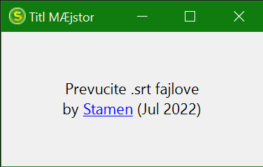

# Titl MÆjstor

<!-- bedzevi -->

Mala aplikacija koja služi da pretvori
titlove u UTF-8-BOM i prepravi simbole
kao što su Æ u Ć.

Prevucite .srt fajl ili fajlove kako bi
ih konvertovali. Veličina prozora je
promenljiva.

## :warning: **Originalni (prevučeni) fajl ili fajlovi će biti izmenjeni** :warning:

### Konverzije podržanih karaktera
| Pre | Posle |
|-----|-------|
|  æ  |   ć   |
|  Æ  |   Ć   |
|  è  |   č   |
|  È  |   Č   |
|  ð  |   đ   |
|  Ð  |   Đ   |

### Tehnikalije
- C# Forms Aplikacija
- [.Net 6 Framework](https://dotnet.microsoft.com/en-us/download)
- Nuget Paketi
  - [UTF.Unknown](https://www.nuget.org/packages/UTF.Unknown/)
  - [System.Text.Encoding.CodePages](https://www.nuget.org/packages/System.Text.Encoding.CodePages)
